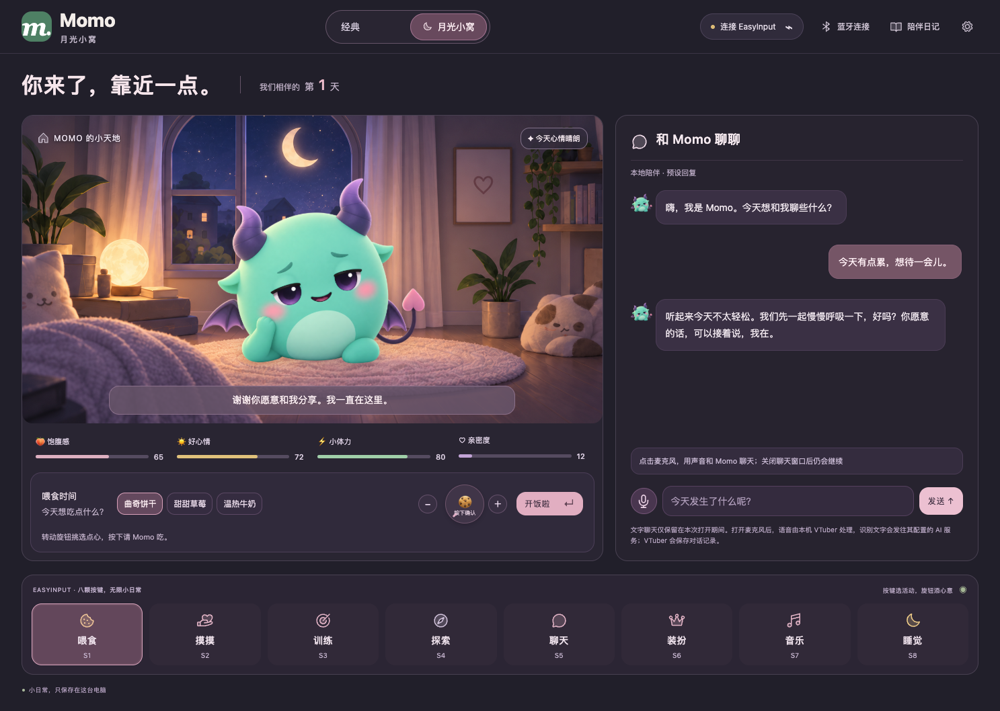
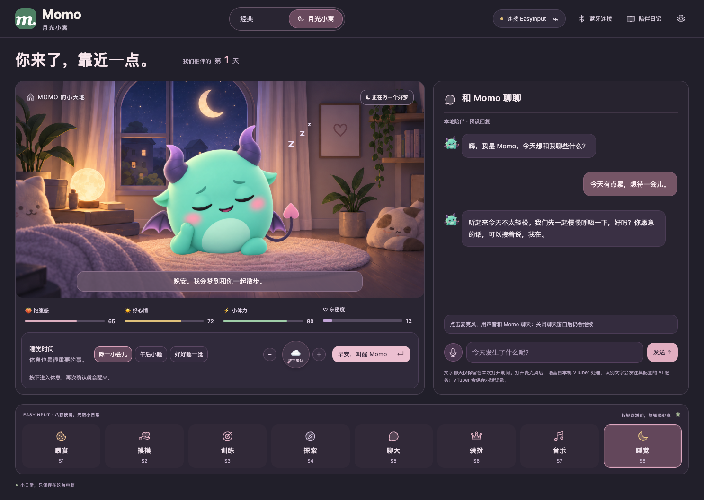
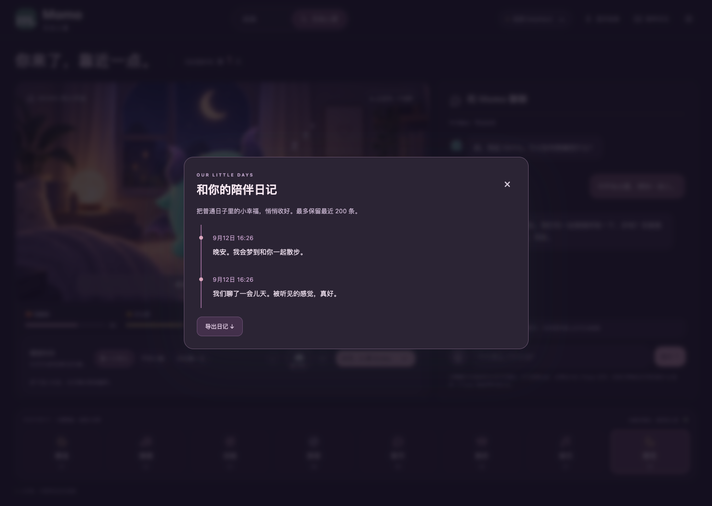
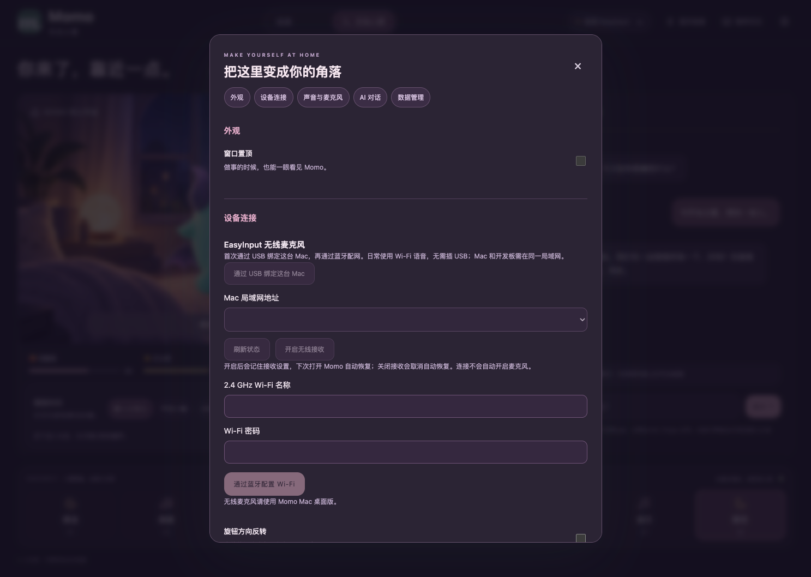

# Momo 月光小窝：双界面使用说明

2026-09-12

## 打开与切换

运行仓库里的 `npm start`，或打开本次独立打包的 `dist/moonlight-preview/Momo-darwin-arm64/Momo.app`。若旧版 Momo 正在运行，请先正常退出旧版，再打开新版；Momo 使用单实例机制。

顶部点击 **月光小窝** 即可进入新版，点击 **经典** 返回原界面。首次打开默认经典，以后记住上次选择。网页预览与 Electron 使用不同的本地存储，选择和宠物数据各自保存。

切换界面不会刷新页面、重连设备或重新启动语音。宠物状态、当前活动、装扮、日记、聊天消息、输入草稿、训练进度和音乐保持连续。刷新或关闭整个应用仍遵循原有规则：文字聊天、草稿和临时 AI 密钥不持久化。

## 新版布局

- 左侧为月光房间，Momo 使用薄荷绿小魅魔形象：紫色弯角、小蝠翼、心形尾尖和托腮含笑表情。睡眠时切换闭眼形象，保留装扮与活动反馈。
- 右侧聊天常驻，文字、录音及回复使用现有聊天能力。切换到新版不会开启麦克风。
- 房间下方为饱腹感、好心情、体力和亲密度，以及当前活动选项、旋钮和确认按钮。
- 底部 S1–S8 分别对应喂食、摸摸、训练、探索、聊天、装扮、音乐和睡觉，实体控制方式保持原样。
- S5 开始录音，再按 S5 发送；聊天活动下按旋钮查看对话。界面麦克风为连续语音入口。新版聊天常驻不会拦截其他活动。
- 日记以时间线显示，仍可导出。设置按外观、设备连接、声音与麦克风、AI 对话、数据管理分组。
- 窗口宽度小于 1050px 时上下排列，八键变为两行；较小窗口可纵向滚动，聊天记录在独立区域滚动。

经典聊天弹窗、日记或设置打开时，先关闭弹窗再点击顶部切换。关闭聊天显示不等于关闭麦克风；请使用麦克风按钮或语音状态栏停止录音。

## 实现说明

`app/ui-theme.mjs` 只负责展示和移动已有 DOM，使用独立键 `momo.ui.theme.v1` 保存 `classic | moonlight`。无效值回退经典；存储不可用时仍可切换，并提示本次选择无法记住。宠物存储格式及硬件、语音协议没有变化。

聊天内容节点在经典弹窗与新版侧栏之间移动，输入、消息和监听器不被复制。设置中的 USB、蓝牙、无线语音、提示音、AI 表单也复用原节点。样式限定在新版主题下，经典宠物继续使用原 SVG。

房间与角色是独立图片；UI 文字、按钮、输入框与状态均可真实交互。图片生成方式、闭眼素材的 alpha 遮罩和图标许可见 `app/assets/README.md`。本次沿用现有装扮与活动反馈动画，没有新增骨骼动画或 Live2D 系统。

## 本次验证

| 层级 | 结果 |
| --- | --- |
| 单元测试 | `npm test`：52 / 52 通过，包含新增资源路由及 MIME 检查 |
| 界面回归 | `MOMO_TEST_PORT=4792 npm run test:ui`：41 / 41 通过 |
| 新版连续性 | 三轮语音在倾听、等待和真实 WAV 播放期间双向切换；单一会话，无重复发送、无中断命令 |
| 按键与连接 | 模拟 USB／蓝牙控制、电量、S5 录音、断连与设置回归通过 |
| 实际 Electron 窗口 | 临时独立配置下，喂食、文字聊天、切换和真实窗口置顶 IPC 通过，未见页面异常 |
| 视觉 | 1487×1058、1280×950、850×720、390×844 检查；修复紧凑桌面高度及窄屏隐私说明裁切 |
| Mac 包 | arm64 / Electron 40.0.0 构建成功；包内 UI 源码和三张图片与工作区 SHA-256 一致 |

第一次在沙箱运行 Chrome 或监听回环测试端口被环境拒绝；使用允许这些操作的执行环境重跑后通过。浏览器截图使用测试数据，原有文档截图已恢复，新增证据单独保存在 `docs/moonlight/`。

本次没有烧录或连接实体开发板，没有以真人麦克风完成通话。上述模拟设备、合成音频和软件测试不能代替真实按键、旋钮、电声、麦克风及拔插验收。语音聊天仍需要按 `VOICE-SETUP.md` 启动本机服务，独立 Mac 应用包不包含语音后端运行环境。

## 截图

经典界面：`moonlight/classic.png`；原生窗口：`moonlight/native.png`；窄屏：`moonlight/home-390.png`；设计对照：`moonlight/comparison.png`。完整视觉检查记录见仓库根目录 `design-qa.md`。
